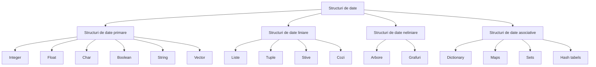

Tring to learn how to use mermaid plugin in the _**obsidian**_. 

```mermaid
flowchart TD

%% Creem obiectele de baza

    A["Structuri de date"]

    B["Structuri de date primare"]

    C["Structuri de date liniare"]

    D["Structuri de date neliniare"]

    E["Structuri de date asociative"]

  
  

%% Creem legatura intre obiectele de baza

A --> B

A --> C

A --> D

A --> E

  

%%Structuri de date primare

  

%% Creem obiectele pentru Structuri de date primare

F[Integer]

G[Float]

H[Char]

I[Boolean]

J[String]

K[Vector]

  

%% Creem legatura intre obiectele Structuri de date primare

B --> F

B --> G

B --> H

B --> I

B --> J

B --> K

  

%% Structuri de date liniare

  

%% Creem obiectele pentru Structuri de date liniare

L[Liste]

M[Tuple]

N[Stive]

O[Cozi]

  

%% Creem legatura intre obiectele Structuri de date liniare

C --> L

C --> M

C --> N

C --> O

  

%% Structuri de date neliniare

Y[Arbore]

X[Grafuri]

  

D --> Y

D --> X

  

%% Structuri de date asociative

  

dic[Dictionary]

map[Maps]

set[Sets]

hash[Hash tabels]

  

E --> dic

E --> map

E --> set

E --> hash
```
